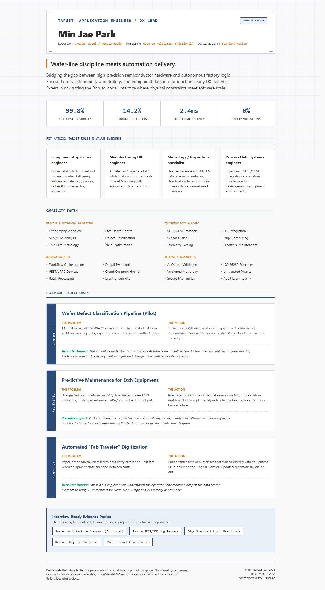
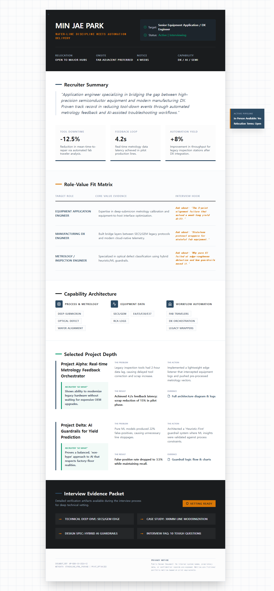
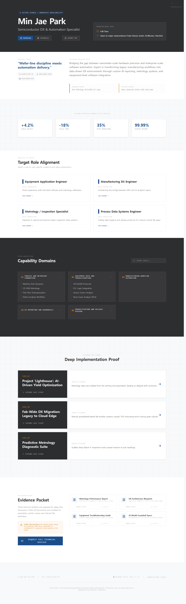

# Gemini Build Parity Scaffold

Local scaffold and instruction kernel for pushing Gemini CLI or Hermes design workers toward AI Studio Build-like frontend output.

This repository is not a fork of Hermes WebUI and is not affiliated with Google AI Studio. It is a standalone workflow package: create an app-first Vite/React/Tailwind workspace, give the design model a Build-like execution context, verify real browser rendering, then optionally package the built app into a direct-open single HTML file.

## Why This Exists

Directly asking a model for a single HTML file often collapses rich interface work into a static page. The stronger route is:

1. Prepare a real app workspace.
2. Keep the user's task intact.
3. Let the design worker own the visual direction.
4. Build and render the result in Chrome.
5. Package to standalone HTML only after the app source exists.

The goal is not to hardcode one visual style. The scaffold supplies execution shape and verification tools, not a house aesthetic.

## What Is Included

| Path | Purpose |
| --- | --- |
| `profile/GEMINI.md` | Design-worker execution kernel. |
| `profile/SKILL.md` | Hermes/Codex skill wrapper. |
| `profile/design_skills/` | Supplemental design craft guidance. |
| `profile/prompt-seeds/` | General high-performing prompt drivers with task content removed. |
| `profile/source-prompts/README.md` | Placeholder for optional source prompt corpus. Raw external prompt files are not redistributed. |
| `scripts/create_build_like_web_app.py` | Creates the Vite/React/Tailwind scaffold. |
| `scripts/package_vite_dist_single_html.py` | Inlines Vite `dist` assets into one browser-openable HTML file. |
| `scripts/capture_chrome_cdp_fullpage.mjs` | Captures desktop and 390px mobile full-page screenshots through Chrome CDP. |
| `scripts/check_project_structure.py` | Confirms app-like project shape without scoring design quality. |
| `docs/evaluation-protocol.md` | Explains evidence-based visual review without fake pass/fail scoring. |
| `evidence/` | Public-safe screenshot comparison from fictional test artifacts. |

## Quick Start: Full One-Shot Route

If the official Gemini CLI is installed and logged in, this is the intended
drop-in command:

```powershell
cd C:\path\to\gemini-build-parity-scaffold
python scripts\run_gemini_design_once.py out\fictional-profile --name "Fictional Profile" --brief-file examples\fictional-recruiter-profile\brief.md --force
```

What this does:

1. Creates the app-first scaffold.
2. Copies `profile/GEMINI.md`, `design_skills/`, `prompt-seeds/`, and `source-prompts/` into the artifact workspace.
3. Runs Gemini CLI inside that workspace, so the local `GEMINI.md` and copied context files are visible to the worker.
4. Runs `npm install`, `npm run lint`, and `npm run build`.
5. Packages `dist` into `standalone.html`.

The scaffold benefit is only fully active when Gemini runs inside the generated
artifact folder. Running Gemini from another directory and merely pasting the
brief will not reproduce the same setup.

## Manual Scaffold Route

```powershell
cd C:\path\to\gemini-build-parity-scaffold
python scripts\create_build_like_web_app.py out\fictional-profile --name "Fictional Profile" --brief-file examples\fictional-recruiter-profile\brief.md --force
cd out\fictional-profile
npm install
```

Then run your design worker in that generated folder. The worker should read `GEMINI.md`, `task.md`, `BUILD_ENVIRONMENT.md`, `AIS_REFERENCE_COMMONS.md`, `design_skills/`, and any optional `source-prompts/` files that you are legally allowed to use.

After the worker edits source files:

```powershell
npm run lint
npm run build
cd ..\..
python scripts\package_vite_dist_single_html.py out\fictional-profile\dist out\fictional-profile\standalone.html
node scripts\capture_chrome_cdp_fullpage.mjs "file:///C:/path/to/gemini-build-parity-scaffold/out/fictional-profile/standalone.html" out\fictional-profile\captures --settle-ms 5000
```

The Chrome CDP capture script is optional. It exists only to make screenshot
evidence reproducible for users who do not already have browser automation in
their agent environment. If your agent can open the local artifact and capture
desktop/mobile screenshots, use that instead.

## Hermes Installation

Install the profile into a Hermes home directory:

```powershell
python scripts\install_hermes_profile.py --hermes-home C:\path\to\.hermes-home --profile design --force
```

This copies the profile to:

```text
<hermes-home>\profiles\design\skills\build-parity-design-director
```

Hermes still needs an agent or task runner that calls either:

```powershell
python scripts\run_gemini_design_once.py <artifact-root> --name "<artifact name>" --brief-file <brief.md> --force
```

or the manual scaffold route above. The install script gives Hermes the skill
and instruction context; the run script gives Gemini the prepared artifact
workspace.

## Evidence Snapshot

These examples use a fictional candidate. They are not about a real person.

| Run | Route | Evidence |
| --- | --- | --- |
| Baseline 1830 | Direct/simple HTML-oriented Gemini run |  |
| Baseline 1840 | Early universal rules route |  |
| Final 0003 | App-first scaffold, design kernel, standalone packaging |  |

The repository does not claim an automatic design score. The evidence exists so humans can compare rendered output and decide whether the workflow is improving the artifact.

## Publication Boundary

This public package deliberately excludes:

- Personal career data.
- Account names, OAuth state, cookies, API keys, tokens, or local auth folders.
- Company-internal facts or confidential implementation details.
- Raw external prompt corpora whose redistribution rights are unclear or incompatible.
- Copied browser-extension backends or native messaging code.

If you add optional external source prompts under `profile/source-prompts/`, verify their license and redistribution rights before publishing your fork.

## License

MIT. See `LICENSE`.
