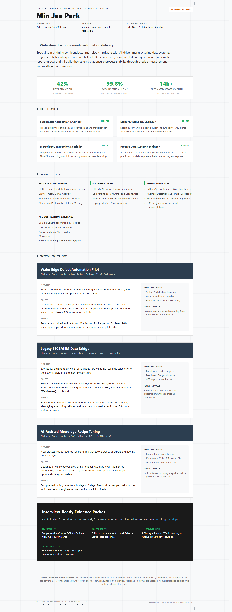

# Gemini Build Parity Scaffold

App-first scaffolding and instruction profile for making Gemini CLI and Hermes produce richer AI Studio Build-like frontend artifacts.

This repository is a runnable setup for giving an AI design worker the same kind of working context that makes hosted app builders stronger: a real project, local instructions, scaffold files, prompt-context slots, design-skill notes, and an export path.

## Languages

- [English](#english)
- [한국어](#한국어)
- [日本語](#日本語)
- [中文](#中文)

## English

### What This Does

Plain CLI prompting often makes the model return a static HTML document. This scaffold changes the working medium:

1. Create a Vite + React + TypeScript + Tailwind app workspace.
2. Copy the design kernel, scaffold context, prompt seeds, and design-skill notes into that workspace.
3. Run Gemini CLI from inside the generated workspace so the model can actually read those files.
4. Build the app.
5. Package the Vite output into `standalone.html` when a portable HTML deliverable is needed.

The goal is not to force a fixed visual style. The goal is to give the model a better environment so it can make a real app surface instead of a thin page.

### Quick Start

```powershell
git clone https://github.com/heelee912/gemini-build-parity-scaffold.git
cd gemini-build-parity-scaffold
python scripts\run_gemini_design_once.py out\fictional-profile --name "Fictional Profile" --brief-file examples\fictional-recruiter-profile\brief.md --force
```

The command creates a scaffold, runs Gemini CLI in that scaffold, runs `npm install`, `npm run lint`, `npm run build`, and writes:

```text
out\fictional-profile\standalone.html
```

### Manual Agent Route

If your agent already controls Gemini, use only the scaffold step:

```powershell
python scripts\create_build_like_web_app.py out\my-artifact --name "My Artifact" --brief-file brief.md --force
```

Then run the design worker from `out\my-artifact`, not from the repository root. The worker should read:

```text
GEMINI.md
task.md
BUILD_ENVIRONMENT.md
AIS_REFERENCE_COMMONS.md
design_skills/
prompt-seeds/
source-prompts/
src/
```

After the worker edits the app:

```powershell
cd out\my-artifact
npm install
npm run lint
npm run build
cd ..\..
python scripts\package_vite_dist_single_html.py out\my-artifact\dist out\my-artifact\standalone.html
```

### Hermes Setup

Install the profile into a Hermes home:

```powershell
python scripts\install_hermes_profile.py --hermes-home C:\path\to\.hermes-home --profile design --force
```

It copies this repository's profile into:

```text
<hermes-home>\profiles\design\skills\build-parity-design-director
```

Hermes then has the skill and instruction profile. To get the scaffold benefit, the Hermes task still needs to call the runner or create the scaffold before delegating to Gemini:

```powershell
python C:\path\to\gemini-build-parity-scaffold\scripts\run_gemini_design_once.py C:\path\to\artifact --name "Artifact" --brief-file C:\path\to\brief.md --force
```

### Optional Source Prompts

Raw AI Studio prompt files are not redistributed here. If you have legally usable prompt files, place them in:

```text
profile\source-prompts\
```

The scaffold copies that folder into every generated artifact so Gemini can read it locally.

## 한국어

### 이 저장소가 하는 일

CLI에서 Gemini에게 바로 HTML을 만들라고 하면 정적인 단일 문서로 수렴하기 쉽습니다. 이 저장소는 작업 매체 자체를 바꿉니다.

1. Vite + React + TypeScript + Tailwind 앱 작업 공간을 만듭니다.
2. 디자인 커널, 스캐폴드 문맥, 프롬프트 시드, 디자인 스킬 노트를 그 작업 공간 안에 복사합니다.
3. Gemini CLI를 생성된 작업 공간 안에서 실행해서 모델이 실제로 해당 파일들을 읽게 합니다.
4. 앱을 빌드합니다.
5. 휴대 가능한 HTML 산출물이 필요하면 Vite 결과물을 `standalone.html`로 패키징합니다.

목표는 특정 디자인 스타일을 강제하는 것이 아닙니다. 모델이 얇은 페이지가 아니라 실제 앱 표면을 만들 수 있도록 더 좋은 작업 환경을 제공하는 것입니다.

### 빠른 시작

```powershell
git clone https://github.com/heelee912/gemini-build-parity-scaffold.git
cd gemini-build-parity-scaffold
python scripts\run_gemini_design_once.py out\fictional-profile --name "Fictional Profile" --brief-file examples\fictional-recruiter-profile\brief.md --force
```

이 명령은 스캐폴드를 만들고, 그 안에서 Gemini CLI를 실행하고, `npm install`, `npm run lint`, `npm run build`를 실행한 뒤 아래 파일을 만듭니다.

```text
out\fictional-profile\standalone.html
```

### 수동 에이전트 경로

이미 Gemini를 제어하는 에이전트가 있다면 스캐폴드만 생성해도 됩니다.

```powershell
python scripts\create_build_like_web_app.py out\my-artifact --name "My Artifact" --brief-file brief.md --force
```

그 다음 디자인 워커를 저장소 루트가 아니라 `out\my-artifact` 안에서 실행해야 합니다. 워커가 읽어야 하는 파일은 아래입니다.

```text
GEMINI.md
task.md
BUILD_ENVIRONMENT.md
AIS_REFERENCE_COMMONS.md
design_skills/
prompt-seeds/
source-prompts/
src/
```

워커가 앱을 수정한 뒤에는 아래처럼 빌드하고 단일 HTML로 패키징합니다.

```powershell
cd out\my-artifact
npm install
npm run lint
npm run build
cd ..\..
python scripts\package_vite_dist_single_html.py out\my-artifact\dist out\my-artifact\standalone.html
```

### Hermes 적용 방법

Hermes home에 profile을 설치합니다.

```powershell
python scripts\install_hermes_profile.py --hermes-home C:\path\to\.hermes-home --profile design --force
```

복사되는 위치는 아래입니다.

```text
<hermes-home>\profiles\design\skills\build-parity-design-director
```

이렇게 하면 Hermes가 스킬과 지침 프로필을 갖게 됩니다. 단, 스캐폴드의 이점을 얻으려면 Hermes 작업이 Gemini에게 넘기기 전에 아래 runner를 호출하거나 스캐폴드를 직접 만들어야 합니다.

```powershell
python C:\path\to\gemini-build-parity-scaffold\scripts\run_gemini_design_once.py C:\path\to\artifact --name "Artifact" --brief-file C:\path\to\brief.md --force
```

### 선택적 source prompt

AI Studio 원문 prompt 파일은 이 저장소에 재배포하지 않습니다. 합법적으로 사용할 수 있는 파일이 있다면 아래 폴더에 넣으십시오.

```text
profile\source-prompts\
```

스캐폴드는 이 폴더를 생성되는 모든 artifact에 복사하므로 Gemini가 로컬에서 읽을 수 있습니다.

## 日本語

### このリポジトリの目的

Gemini CLI に直接 HTML を依頼すると、静的な単一ページに寄りやすくなります。このリポジトリは作業媒体そのものを変えます。

1. Vite + React + TypeScript + Tailwind のアプリ作業環境を作成します。
2. デザインカーネル、スキャフォールド文脈、プロンプトシード、デザインスキルノートをその作業環境にコピーします。
3. 生成された作業環境内で Gemini CLI を実行し、モデルがそれらのファイルを読めるようにします。
4. アプリをビルドします。
5. ポータブルな HTML が必要な場合は、Vite の出力を `standalone.html` にパッケージ化します。

固定されたビジュアルスタイルを強制するためのものではありません。薄いページではなく、実際のアプリ表面を作れる作業環境をモデルに与えるためのものです。

### クイックスタート

```powershell
git clone https://github.com/heelee912/gemini-build-parity-scaffold.git
cd gemini-build-parity-scaffold
python scripts\run_gemini_design_once.py out\fictional-profile --name "Fictional Profile" --brief-file examples\fictional-recruiter-profile\brief.md --force
```

生成物:

```text
out\fictional-profile\standalone.html
```

### Hermes への適用

```powershell
python scripts\install_hermes_profile.py --hermes-home C:\path\to\.hermes-home --profile design --force
```

インストール先:

```text
<hermes-home>\profiles\design\skills\build-parity-design-director
```

Hermes 側では、この skill を参照しつつ、Gemini に渡す前に `run_gemini_design_once.py` で artifact workspace を作成して実行します。

## 中文

### 本仓库的作用

直接让 Gemini CLI 生成 HTML 时，结果很容易退化成静态单页。本仓库改变的是工作介质。

1. 创建 Vite + React + TypeScript + Tailwind 应用工作区。
2. 把设计内核、脚手架上下文、提示种子和设计技能说明复制到该工作区。
3. 在生成的工作区内部运行 Gemini CLI，让模型真正读取这些文件。
4. 构建应用。
5. 如果需要可携带的 HTML 交付物，把 Vite 输出打包为 `standalone.html`。

它不是为了强制某一种视觉风格，而是为了让模型在更完整的工程环境中生成真正的应用界面。

### 快速开始

```powershell
git clone https://github.com/heelee912/gemini-build-parity-scaffold.git
cd gemini-build-parity-scaffold
python scripts\run_gemini_design_once.py out\fictional-profile --name "Fictional Profile" --brief-file examples\fictional-recruiter-profile\brief.md --force
```

输出文件:

```text
out\fictional-profile\standalone.html
```

### Hermes 集成

```powershell
python scripts\install_hermes_profile.py --hermes-home C:\path\to\.hermes-home --profile design --force
```

安装位置:

```text
<hermes-home>\profiles\design\skills\build-parity-design-director
```

Hermes 需要在委托给 Gemini 之前调用 `run_gemini_design_once.py`，或先创建 scaffold 后再让 Gemini 在 artifact 工作区中运行。

## Repository Contents

| Path | Purpose |
| --- | --- |
| `profile/GEMINI.md` | Design-worker execution kernel. |
| `profile/SKILL.md` | Hermes/Codex skill wrapper. |
| `profile/design_skills/` | Supplemental design craft guidance. |
| `profile/prompt-seeds/` | General high-performing prompt drivers with task content removed. |
| `profile/source-prompts/README.md` | Placeholder for optional source prompt corpus. |
| `scripts/run_gemini_design_once.py` | End-to-end scaffold + Gemini CLI + build + package runner. |
| `scripts/create_build_like_web_app.py` | Creates the Vite/React/Tailwind scaffold only. |
| `scripts/install_hermes_profile.py` | Installs the profile into a Hermes home. |
| `scripts/package_vite_dist_single_html.py` | Inlines Vite `dist` assets into one browser-openable HTML file. |
| `scripts/check_project_structure.py` | Confirms app-like project shape. |
| `evidence/` | Fictional workflow proof images. |

## Workflow Proof

The following images use a fictional candidate. They are not about a real person.

| Route | Output |
| --- | --- |
| Vanilla Gemini CLI. Same prompt, no scaffold, no `GEMINI.md`, no source prompt context. |  |
| Early 1818 route. Some instruction existed, but the app-first scaffold was not stabilized. |  |
| Early 1848 route. Visible-first-paint rule set, still static-output oriented. |  |
| Final 0003 route. App-first scaffold, design kernel, standalone packaging. |  |

### 0003 Interaction Demo


## Related Work

The idea here is close to agent scaffolding: surrounding the model with workspace structure, tools, instructions, state, and execution feedback instead of relying on one prompt.

- [Inside the Scaffold: A Source-Code Taxonomy of Coding Agent Architectures](https://arxiv.org/abs/2604.03515)
- [BISCUIT: Scaffolding LLM-Generated Code with Ephemeral UIs in Computational Notebooks](https://machinelearning.apple.com/research/biscuit-scaffolding-llm)
- [TableTalk: Scaffolding Spreadsheet Development with a Language Agent](https://www.microsoft.com/en-us/research/publication/tabletalk-scaffolding-spreadsheet-development-with-a-language-agent/)

## Publication Boundary

This public package deliberately excludes:

- Personal career data.
- Account names, OAuth state, cookies, API keys, tokens, or local auth folders.
- Company-internal facts or confidential implementation details.
- Raw external prompt corpora whose redistribution rights are unclear or incompatible.
- Copied browser-extension backends or native messaging code.

## License

MIT. See `LICENSE`.
