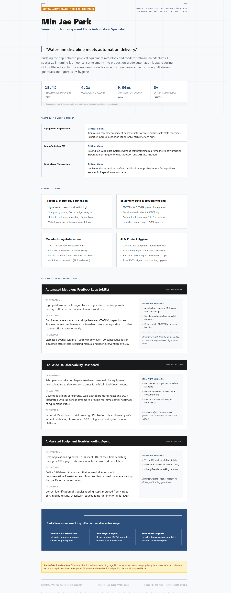
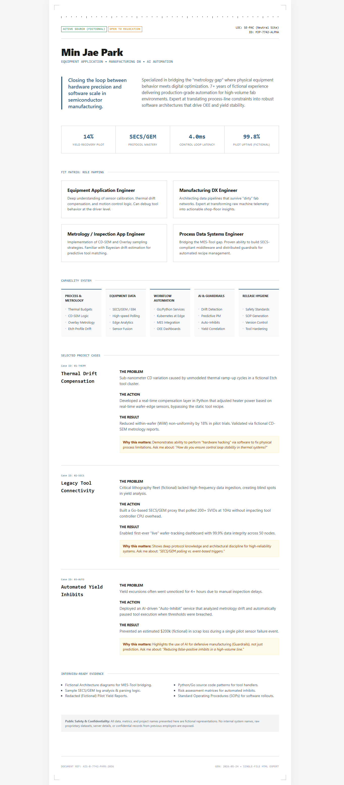
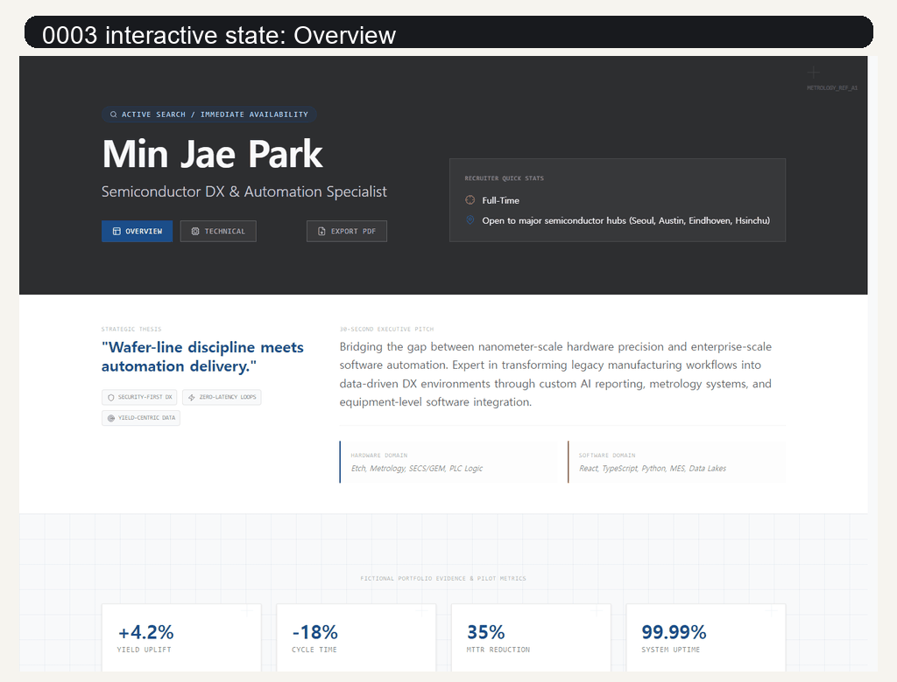

# Gemini Build Parity Scaffold

面向 Gemini CLI 和 Hermes 设计 worker 的应用优先脚手架，用来更接近 AI Studio Build 风格的前端产物。

[English](../README.md) · [한국어](README.ko.md) · [日本語](README.ja.md) · 中文

它给模型一个更好的工作介质：真实的 Vite 应用、本地设计指令、可选 source prompt 槽位、设计技能笔记，以及从应用源码导出 standalone HTML 的路径。

## 改变了什么

直接提示 Gemini CLI 时，结果很容易退化成一个静态 HTML 文件。本仓库让 worker 先在真实前端项目中工作，再在应用成立之后导出 HTML。

此表中的输出均为同一份公开安全 brief 的 one-shot 结果。

| 路径 | One-shot 公开安全输出 |
| --- | --- |
| Vanilla 简单指令 v1 |  |
| Vanilla 简单指令 v2 |  |
| Build-parity scaffold 0003 |  |

## 0003 交互

最终产物不是静态页面。点击按钮会切换整个 view context，并展示不同的应用状态。



所有图片都使用虚构内容。它们用于说明工作流效果。

## Gemini CLI 快速开始

```powershell
git clone https://github.com/heelee912/gemini-build-parity-scaffold.git
cd gemini-build-parity-scaffold
python scripts\run_gemini_design_once.py out\fictional-profile --name "Fictional Profile" --brief-file examples\fictional-recruiter-profile\brief.md --force
```

runner 会执行：

1. 创建 Vite + React + TypeScript + Tailwind 工作区。
2. 把 `profile/GEMINI.md`, `profile/SKILL.md`, `design_skills/`, `prompt-seeds/`, `source-prompts/` 复制到工作区。
3. 把用户 brief 写入 `task.md`。
4. 从生成的工作区内部运行 Gemini CLI，让 Gemini 直接读取 scaffold 文件。
5. 执行 `npm install`, `npm run lint`, `npm run build`。
6. 把 Vite `dist` 打包为 `standalone.html`。

输出：

```text
out\fictional-profile\standalone.html
```

## 手动代理路径

如果你的 agent 已经能控制 Gemini，可以只创建 scaffold：

```powershell
python scripts\create_build_like_web_app.py out\my-artifact --name "My Artifact" --brief-file brief.md --force
```

然后从 `out\my-artifact` 运行设计 worker，而不是从仓库根目录运行。worker 应读取：

```text
GEMINI.md
task.md
BUILD_ENVIRONMENT.md
AIS_REFERENCE_COMMONS.md
design_skills/
prompt-seeds/
source-prompts/
src/
```

worker 修改应用后：

```powershell
cd out\my-artifact
npm install
npm run lint
npm run build
cd ..\..
python scripts\package_vite_dist_single_html.py out\my-artifact\dist out\my-artifact\standalone.html
```

## Hermes 设置

把 design profile 安装到 Hermes home：

```powershell
python scripts\install_hermes_profile.py --hermes-home C:\path\to\.hermes-home --profile design --force
```

安装位置：

```text
<hermes-home>\profiles\design\skills\build-parity-design-director
```

Hermes 主 agent 可以按以下方式使用：

```text
使用 build-parity-design-director profile。
用 run_gemini_design_once.py 创建 artifact 工作区。
在生成的 artifact 工作区内运行 Gemini 设计 worker。
返回可运行源码路径和 standalone.html 路径。
```

或：

```text
先使用 create_build_like_web_app.py。
在生成的工作区内委托 Gemini。
Gemini 修改应用后，运行 npm install、npm run lint、npm run build 和 package_vite_dist_single_html.py。
```

Hermes 不需要 fork core。本仓库的集成点是 profile 和外部 runner。

## Gemini 会看到什么

每个生成的 artifact 都是自描述结构：

```text
artifact/
  GEMINI.md
  SKILL.md
  task.md
  BUILD_ENVIRONMENT.md
  AIS_REFERENCE_COMMONS.md
  design_skills/
  prompt-seeds/
  source-prompts/
  package.json
  vite.config.ts
  tsconfig.json
  index.html
  src/
    App.tsx
    data.ts
    types.ts
    index.css
    components/
      README.md
```

重点是执行上下文。Gemini 不是只收到一个 prompt，而是在一个已经说明实现介质、可用依赖、移动端要求、打包路径和可选 source context 的应用工作区内运行。

## 可选 Source Prompts

本仓库不再分发 AI Studio 原始 prompt 文件。如果你有可以合法使用的 prompt 文件，请放入：

```text
profile\source-prompts\
```

scaffold 会把该文件夹复制到每个生成的 artifact 中，让 Gemini 可以本地读取。

## 仓库内容

| Path | Purpose |
| --- | --- |
| `profile/GEMINI.md` | 设计 worker 执行核心。它要求 Gemini app-first 构建并自行决定视觉方向。 |
| `profile/SKILL.md` | 给 Hermes 或其他 agent 系统使用的 skill wrapper。 |
| `profile/design_skills/` | 会复制到每个 artifact 的补充设计笔记。 |
| `profile/prompt-seeds/` | 移除任务内容后的通用高表现 prompt driver。 |
| `profile/source-prompts/README.md` | 可选 source prompt corpus 的占位说明。该 corpus 不随仓库再分发。 |
| `scripts/run_gemini_design_once.py` | 一次性完成 scaffold、Gemini CLI、install、lint、build、standalone HTML 打包。 |
| `scripts/create_build_like_web_app.py` | 只创建 Vite/React/Tailwind scaffold。适合已有 agent 控制 Gemini 的情况。 |
| `scripts/install_hermes_profile.py` | 把 profile 安装到 Hermes home。 |
| `scripts/package_vite_dist_single_html.py` | 把 Vite `dist` assets inline 成可在浏览器打开的单个 HTML。 |
| `examples/fictional-recruiter-profile/` | 公开安全的示例 brief。 |
| `evidence/` | 使用虚构数据的截图和交互 GIF。 |

## 相关研究

本仓库采用的思路接近 scaffolding：不要只依赖单个 prompt，而是用 workspace 结构、工具、指令、状态和执行反馈包围模型。

- [Inside the Scaffold: A Source-Code Taxonomy of Coding Agent Architectures](https://arxiv.org/abs/2604.03515)
- [BISCUIT: Scaffolding LLM-Generated Code with Ephemeral UIs in Computational Notebooks](https://machinelearning.apple.com/research/biscuit-scaffolding-llm)
- [TableTalk: Scaffolding Spreadsheet Development with a Language Agent](https://www.microsoft.com/en-us/research/publication/tabletalk-scaffolding-spreadsheet-development-with-a-language-agent/)

## 发布边界

本公开包刻意排除：

- 个人职业数据
- 账号名、OAuth 状态、cookie、API key、token、local auth folder
- 公司内部事实或机密实现细节
- 再分发权利不明确或许可证不兼容的外部 raw prompt corpus
- 复制的 browser-extension backend 或 native messaging code

## License

MIT. See `LICENSE`.
